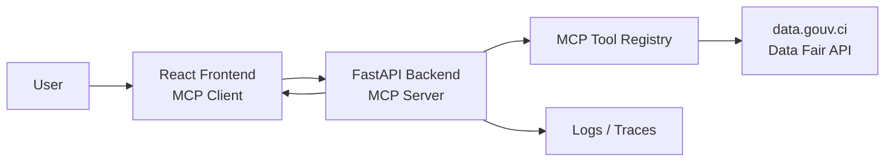
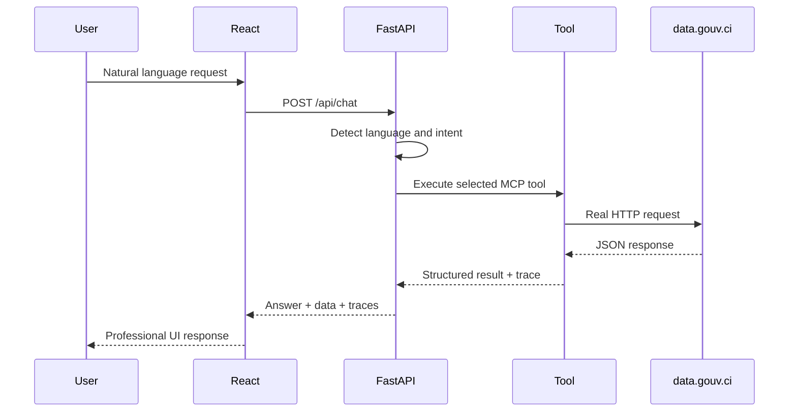
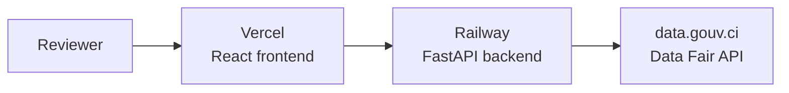
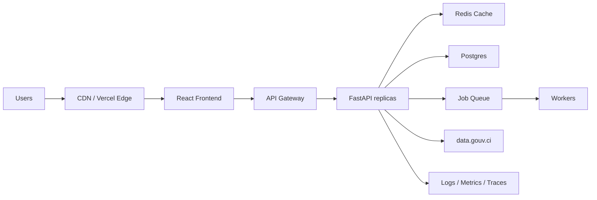

# Architecture Decision Document

Project: Liwaza GovData Assistant  
Date: 2026-06-10  
Public service API: data.gouv.ci / Data Fair API

## 1. Product Summary

Liwaza GovData Assistant is an AI-native eGov platform that lets users query public datasets from Côte d'Ivoire through natural language.

The system is intentionally simple but real:

- the frontend is a React MCP client;
- the backend is a Python/FastAPI MCP server;
- all government API calls go through the backend;
- tool execution is real and visible;
- data comes from `https://data.gouv.ci/data-fair/api/v1`.

## 2. Current Architecture

## 3. Service Interactions

1. The user submits a message in French or English.
2. The frontend sends the message to `POST /api/chat`.
3. The backend detects the language using `lingua-language-detector`.
4. The backend detects the intent.
5. The backend selects the appropriate MCP tool.
6. The MCP tool calls data.gouv.ci.
7. The backend returns a structured response with tool traces.
8. The frontend displays the answer, traceability, and structured results.

## 4. Mandatory MCP Boundary

The frontend never calls data.gouv.ci directly.

This is deliberate:

- validation belongs in the backend;
- logging belongs in the backend;
- API error handling belongs in the backend;
- MCP tool execution must be inspectable;
- business logic must not leak into the frontend.

## 5. Backend

Required stack:

- Python
- FastAPI
- Pydantic

Main responsibilities:

- expose MCP-style tools;
- validate all inputs;
- execute real API calls;
- return structured outputs;
- handle API timeouts and invalid requests;
- expose OpenAPI docs;
- provide health and readiness endpoints.

Current backend endpoints include:

- `GET /health`
- `GET /ready`
- `GET /version`
- `GET /mcp/tools`
- `GET /mcp/capabilities`
- `GET /mcp/resources`
- `GET /mcp/prompts`
- `POST /mcp/initialize`
- `POST /mcp/tools/search_public_datasets`
- `POST /mcp/tools/get_dataset_details`
- `POST /mcp/tools/get_dataset_schema`
- `POST /mcp/tools/query_dataset_rows`
- `POST /mcp/tools/get_field_values`
- `POST /mcp/tools/get_numeric_metrics`
- `POST /mcp/tools/compare_indicator_by_year`
- `POST /mcp/tools/summarize_public_dataset`
- `POST /mcp/tools/assess_dataset_quality`
- `POST /mcp/tools/build_chart_data`
- `POST /mcp/tools/recommend_followup_questions`
- `POST /api/chat`
- `GET /api/conversations/examples`
- `GET /api/public-config`

## 6. MCP Tool Design

The tools are designed around useful public-data workflows:

- search;
- inspect;
- read rows;
- compare indicators;
- summarize;
- prepare visual data;
- assess quality;
- recommend next actions.

Current tools:

- `search_public_datasets`
- `get_dataset_details`
- `get_dataset_schema`
- `query_dataset_rows`
- `get_field_values`
- `get_numeric_metrics`
- `compare_indicator_by_year`
- `summarize_public_dataset`
- `assess_dataset_quality`
- `build_chart_data`
- `recommend_followup_questions`

Design reasoning:

- each tool has one clear responsibility;
- tools return structured JSON;
- tool traces are visible in the UI;
- tools are testable independently;
- the API source remains auditable.

## 7. Frontend

Stack:

- React
- TypeScript
- Vite
- CSS modules through a simple global design system
- lucide-react icons

Main UI concepts:

- conversational interface;
- automatic language mode;
- FR/EN manual override;
- traceability panel;
- structured result cards;
- empty states;
- professional eGov tone.

## 8. Data Flow

## 9. Monorepo Decision

Chosen approach: monorepo.

Why:

- simpler for a 12-15 hour technical assessment;
- one repository to review;
- shared documentation;
- easier Docker Compose setup;
- easier CI workflow.

Advantages:

- faster onboarding;
- consistent versioning;
- easier local development;
- frontend/backend changes can be reviewed together.

Disadvantages:

- less separation for larger teams;
- repository can grow over time;
- permissions are less granular than multi-repo.

## 10. Deployment Topology

Recommended deployment:

Recommended services:

- Frontend: Vercel
- Backend: Railway
- Repository: GitHub public

Why:

- free tiers are available;
- setup is fast;
- public URLs are easy to share;
- logs are accessible during review.

## 11. Security Considerations

Current MVP:

- Pydantic validation;
- optional `X-API-Key`;
- CORS configuration;
- HTTP timeouts;
- no frontend direct access to government APIs;
- no secrets committed;
- `.env.example` included.

Production improvements:

- OAuth or JWT for authenticated users;
- rate limiting;
- API gateway;
- request signing;
- structured audit logs;
- secret manager;
- stricter CORS;
- monitoring and alerting.

## 12. Scalability: 100 Users

For 100 users:

- one backend instance is enough;
- no database is required for the MVP;
- caching can remain in-memory;
- logs can be platform logs;
- Vercel + Railway is sufficient.

Priorities:

- clear error handling;
- response time monitoring;
- API timeout handling;
- lightweight caching for repeated dataset metadata.

## 13. Scalability: 100,000 Users

For 100,000 users:

- horizontal backend scaling;
- CDN for frontend;
- Redis cache for dataset metadata and frequent queries;
- background jobs for expensive summaries;
- database for user conversations and saved datasets;
- queue system for heavy operations;
- observability stack;
- rate limiting by user/IP/API key;
- fallback provider strategy for AI calls;
- cost monitoring.

Suggested architecture:

## 14. Cost Considerations

MVP:

- frontend free tier;
- backend free tier;
- no paid database;
- no required paid LLM;
- public API only.

Production:

- API hosting cost grows with traffic;
- LLM cost grows with summarization volume;
- cache reduces repeated calls;
- batch processing reduces repeated analysis;
- open-source/self-hosted models can reduce sensitive-data dependency.

## 15. Observability

Current:

- request duration header;
- backend request logs;
- tool execution trace returned to frontend.

Recommended:

- request IDs;
- structured JSON logs;
- error aggregation;
- uptime checks;
- latency dashboards;
- per-tool success/error metrics.

## 16. Key Tradeoffs

| Decision | Benefit | Tradeoff |
|---|---|---|
| data.gouv.ci instead of FNE | Public, testable API | Less transactional than tax APIs |
| Monorepo | Faster delivery | Less team isolation |
| FastAPI | Strong validation and docs | Python backend only |
| Rule-based intent routing | Simple and transparent | Less flexible than LLM routing |
| Local language detection | Private and fast | Adds dependency size |
| No database in MVP | Simpler setup | No persistent history |

## 17. Sources

- MCP documentation: https://modelcontextprotocol.io/docs/getting-started/intro
- data.gouv.ci portal: https://data.gouv.ci/datasets
- Data Fair API docs: https://data-fair.github.io/3/interoperate/api/
- FastAPI docs: https://fastapi.tiangolo.com/
