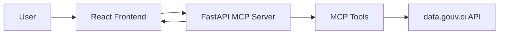
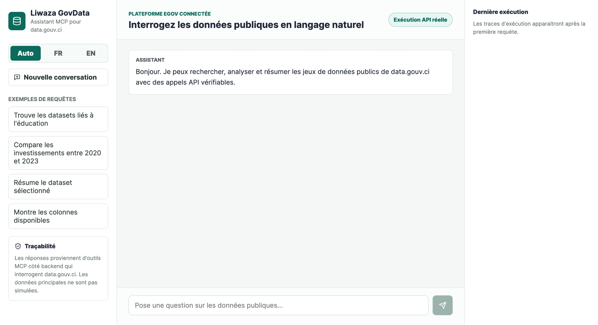
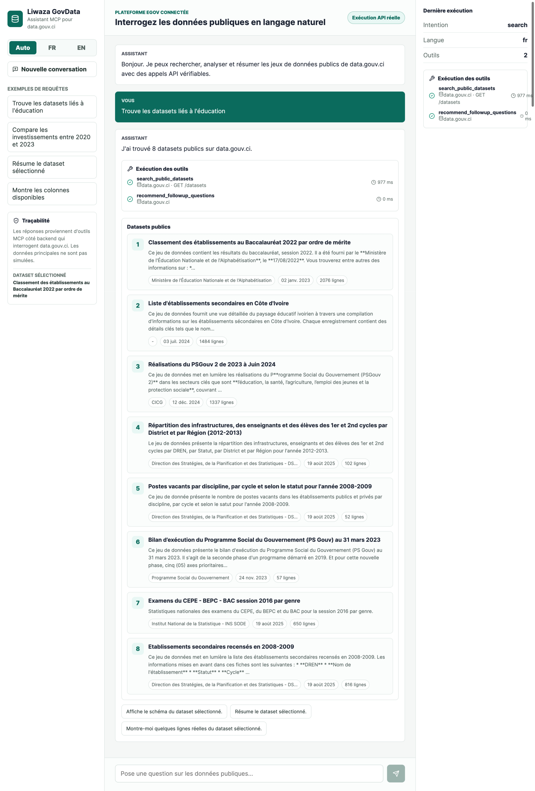
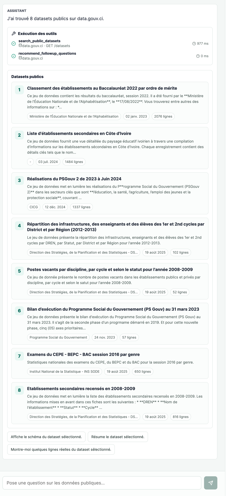
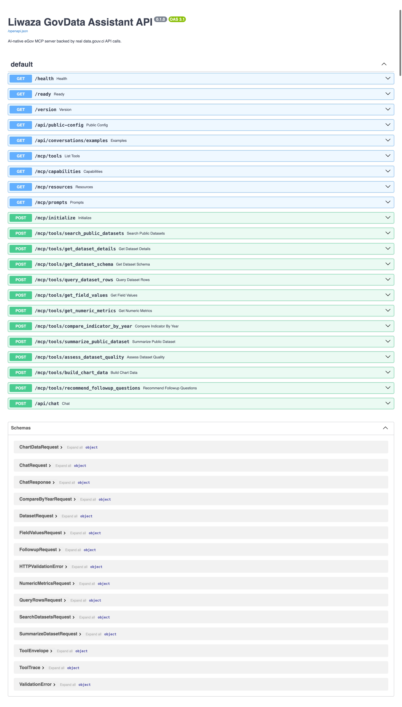
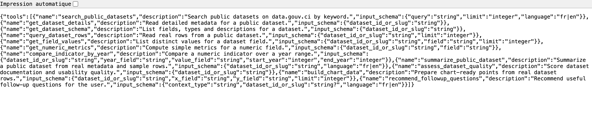
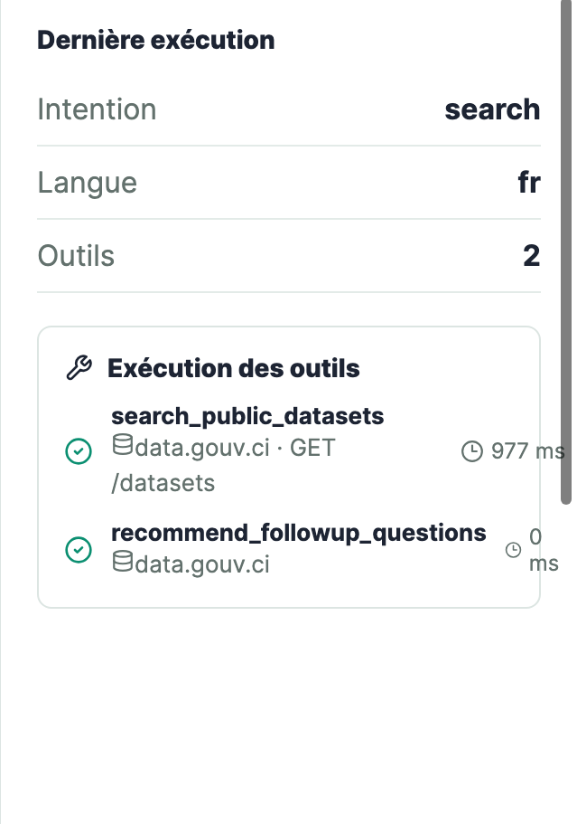
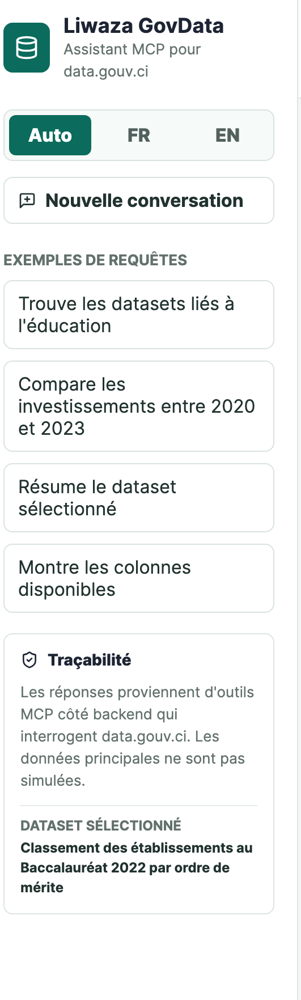

# Liwaza GovData Assistant

AI-native eGov assistant for querying Côte d'Ivoire public datasets through MCP-style tools.

The application lets users ask questions in French or English and receive structured, source-backed answers from real data.gouv.ci API calls.

```text
React Frontend -> FastAPI MCP Server -> data.gouv.ci Data Fair API
```

## 1. Assessment Fit

This project addresses the Liwaza Junior Full Stack Engineer technical assessment:

- React frontend acting as MCP client;
- Python/FastAPI backend acting as MCP server;
- Pydantic validation;
- real public API integration;
- at least 5 MCP tools;
- visible tool execution;
- documentation;
- Docker;
- CI/CD workflow;
- AI strategy;
- architecture reasoning.

## 2. What Is Already Done

Implemented:

- monorepo structure;
- FastAPI backend;
- React frontend;
- automatic FR/EN language detection;
- 11 MCP tools;
- 15+ backend endpoints;
- real data.gouv.ci calls;
- tool execution visibility;
- structured result cards;
- empty states;
- Dockerfile backend;
- Dockerfile frontend;
- docker-compose;
- GitHub Actions CI;
- benchmark document;
- architecture document;
- AI strategy document;
- AI usage disclosure;
- cahier des charges.

Still required before final submission:

- production screenshots;
- final walkthrough video;
- optional extra integration tests.

## 3. Product Overview

Users can ask:

- `Trouve les datasets liés à l'éducation`
- `Compare les investissements entre 2020 et 2023`
- `Résume le dataset sélectionné`
- `Montre les colonnes disponibles`
- `Search datasets about health`

The backend:

- detects language;
- detects intent;
- chooses the right MCP tool;
- calls data.gouv.ci;
- returns structured data and traces.

## 4. Architecture



Detailed architecture is available in [ARCHITECTURE.md](ARCHITECTURE.md).

## 5. Repository Structure

```text
.
├── apps
│   ├── backend
│   │   ├── app
│   │   ├── tests
│   │   ├── Dockerfile
│   │   └── pyproject.toml
│   └── frontend
│       ├── src
│       ├── Dockerfile
│       └── package.json
├── .github/workflows/ci.yml
├── ARCHITECTURE.md
├── AI_STRATEGY.md
├── AI_USAGE.md
├── BENCHMARK.md
├── CAHIER_DES_CHARGES.md
├── docker-compose.yml
└── README.md
```

## 6. Backend Setup

Use Python 3.12.

```bash
cd apps/backend
/opt/homebrew/bin/python3.12 -m venv .venv312
.venv312/bin/pip install -e ".[dev]"
.venv312/bin/uvicorn app.main:app --reload
```

Backend URLs:

- `http://localhost:8000/health`
- `http://localhost:8000/ready`
- `http://localhost:8000/docs`
- `http://localhost:8000/mcp/tools`
- `http://localhost:8000/mcp/capabilities`

## 7. Frontend Setup

```bash
cd apps/frontend
npm install
npm run dev
```

Frontend URL:

```text
http://localhost:5173
```

## 8. Docker Setup

```bash
docker compose up --build
```

Docker URLs:

- frontend: `http://localhost:8080`
- backend: `http://localhost:8000`

## 9. Public Deployment URLs

- GitHub repository: `https://github.com/ZakyOps/liwaza-govdata`
- Frontend: `https://frontend-two-lemon-48.vercel.app`
- Backend API: `https://liwaza-govdata-backend-production.up.railway.app`
- MCP tools endpoint: `https://liwaza-govdata-backend-production.up.railway.app/mcp/tools`
- API docs: `https://liwaza-govdata-backend-production.up.railway.app/docs`

## 10. Screenshots

Add production screenshots here before final submission. Save the images in `docs/screenshots/` using the filenames below.

### 10.1 Main Chat Interface

Capture the deployed frontend before sending a message.



### 10.2 Dataset Search Result

Capture the result after asking:

```text
Trouve les datasets liés à l'éducation
```



### 10.3 MCP Tool Execution Trace

Capture the visible tool execution panel showing `search_public_datasets` and `recommend_followup_questions`.



### 10.4 Backend API Documentation

Capture the FastAPI documentation page.

URL:

```text
https://liwaza-govdata-backend-production.up.railway.app/docs
```



### 10.5 MCP Tools Endpoint

Capture the MCP tools endpoint response.

URL:

```text
https://liwaza-govdata-backend-production.up.railway.app/mcp/tools
```




### 10.6 Selected Dataset Context

Optional capture showing the selected dataset in the sidebar after a search.



### 10.7 Inspector Trace Detail

Optional capture showing the latest execution inspector on the right side of the interface.



## 11. Environment Variables

Root `.env.example`:

```text
API_KEY=
DATAFAIR_BASE_URL=https://data.gouv.ci/data-fair/api/v1
CORS_ORIGINS=http://localhost:5173,http://127.0.0.1:5173
VITE_BACKEND_URL=http://localhost:8000
VITE_API_KEY=
```

For the MVP, `API_KEY` is optional. If set, frontend requests must include `VITE_API_KEY`.

## 12. MCP Tools

Current tools:

- `search_public_datasets`
- `get_dataset_details`
- `get_dataset_schema`
- `query_dataset_rows`
- `get_field_values`
- `get_numeric_metrics`
- `compare_indicator_by_year`
- `summarize_public_dataset`
- `assess_dataset_quality`
- `build_chart_data`
- `recommend_followup_questions`

Tool discovery endpoint:

```text
GET /mcp/tools
```

## 13. Main API Endpoints

Health and metadata:

- `GET /health`
- `GET /ready`
- `GET /version`
- `GET /api/public-config`
- `GET /api/conversations/examples`

MCP discovery:

- `GET /mcp/tools`
- `GET /mcp/capabilities`
- `GET /mcp/resources`
- `GET /mcp/prompts`
- `POST /mcp/initialize`

Tool execution:

- `POST /mcp/tools/search_public_datasets`
- `POST /mcp/tools/get_dataset_details`
- `POST /mcp/tools/get_dataset_schema`
- `POST /mcp/tools/query_dataset_rows`
- `POST /mcp/tools/get_field_values`
- `POST /mcp/tools/get_numeric_metrics`
- `POST /mcp/tools/compare_indicator_by_year`
- `POST /mcp/tools/summarize_public_dataset`
- `POST /mcp/tools/assess_dataset_quality`
- `POST /mcp/tools/build_chart_data`
- `POST /mcp/tools/recommend_followup_questions`

Conversation:

- `POST /api/chat`

## 14. Example API Test

```bash
curl -s -X POST http://localhost:8000/api/chat \
  -H "Content-Type: application/json" \
  -d '{"message":"Trouve les datasets liés à l’éducation"}'
```

Expected:

- `language`: `fr`
- `intent`: `search`
- tool trace includes `search_public_datasets`
- result comes from data.gouv.ci

## 15. Tests

Backend:

```bash
cd apps/backend
.venv312/bin/pytest
.venv312/bin/ruff check app tests
```

Frontend:

```bash
cd apps/frontend
npm run build
npm audit --audit-level=moderate
```

Verified locally:

- backend tests: 9 passing;
- backend lint: passing;
- frontend build: passing;
- npm audit: 0 vulnerabilities after Vite update;
- real data.gouv.ci calls: verified.

## 16. Deployment Plan

Recommended:

- GitHub public repository;
- Vercel for frontend;
- Railway for backend;
- environment variables configured on hosting providers.

Required public submission URLs:

- frontend URL;
- backend API URL;
- MCP endpoint URL;
- GitHub repository URL.

## 17. Documentation

Project documents:

- [BENCHMARK.md](BENCHMARK.md)
- [CAHIER_DES_CHARGES.md](CAHIER_DES_CHARGES.md)
- [ARCHITECTURE.md](ARCHITECTURE.md)
- [AI_STRATEGY.md](AI_STRATEGY.md)
- [AI_USAGE.md](AI_USAGE.md)
- [TEST_PLAN.md](TEST_PLAN.md)
- [docs/CLEAN_CODE_REVIEW.md](docs/CLEAN_CODE_REVIEW.md)

## 18. Assumptions

- data.gouv.ci is publicly accessible.
- Data Fair API remains available.
- Some datasets may have incomplete metadata.
- Not every dataset is equally useful for comparison or charts.
- The reviewer will inspect traffic and tool execution.

## 19. Tradeoffs

| Decision | Reason | Tradeoff |
|---|---|---|
| data.gouv.ci | Public, real, no private credentials | Less transactional than DGI/FNE |
| deterministic tool routing | Transparent and testable | Less flexible than full LLM routing |
| no database | Faster MVP | no persistent conversations |
| local language detection | private and fast | larger Python dependency |
| monorepo | easier review | less separation at large scale |

## 20. Future Improvements

- persistent conversation history;
- dataset selection UI;
- charts with a charting library;
- Redis caching;
- background jobs for heavy summaries;
- OAuth/JWT;
- stronger integration tests;
- optional LLM-powered summarization;
- FNE/DGI integration when credentials are available.

## 21. Walkthrough Video Checklist

The video should cover:

1. Product overview.
2. Why data.gouv.ci.
3. Architecture.
4. MCP tool design.
5. Backend design.
6. Frontend design.
7. DevOps decisions.
8. Testing strategy.
9. Security considerations.
10. AI/LLM strategy.
11. Future improvements.

## 22. Submission Checklist

Before final submission:

- [x] Push repository to GitHub public.
- [x] Deploy frontend.
- [x] Deploy backend.
- [x] Verify backend `/docs`.
- [x] Verify `/mcp/tools`.
- [x] Verify frontend can call deployed backend.
- [ ] Add screenshots to README.
- [ ] Add `docs/screenshots/01-main-chat.png`.
- [ ] Add `docs/screenshots/02-dataset-search.png`.
- [ ] Add `docs/screenshots/03-tool-trace.png`.
- [ ] Add `docs/screenshots/04-api-docs.png`.
- [ ] Add `docs/screenshots/05-mcp-tools.png`.
- [ ] Optional: add `docs/screenshots/06-selected-dataset-context.png`.
- [ ] Optional: add `docs/screenshots/07-inspector-trace.png`.
- [ ] Record 10-15 minute English walkthrough video.
- [x] Submit GitHub repository URL.
- [x] Submit frontend URL.
- [x] Submit backend API URL.
- [x] Submit MCP endpoint URL.
- [ ] Submit architecture document.
- [ ] Submit AI strategy document.
- [ ] Submit walkthrough video.
